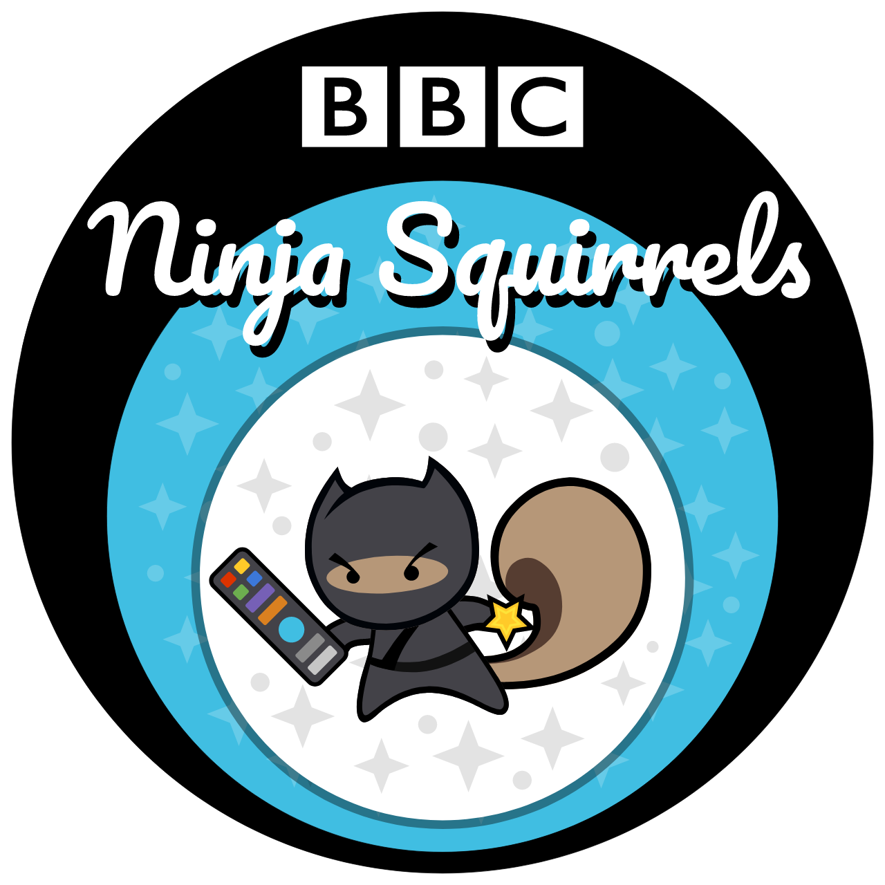
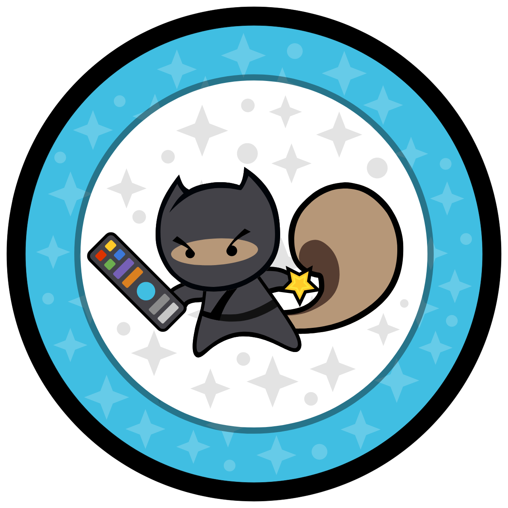
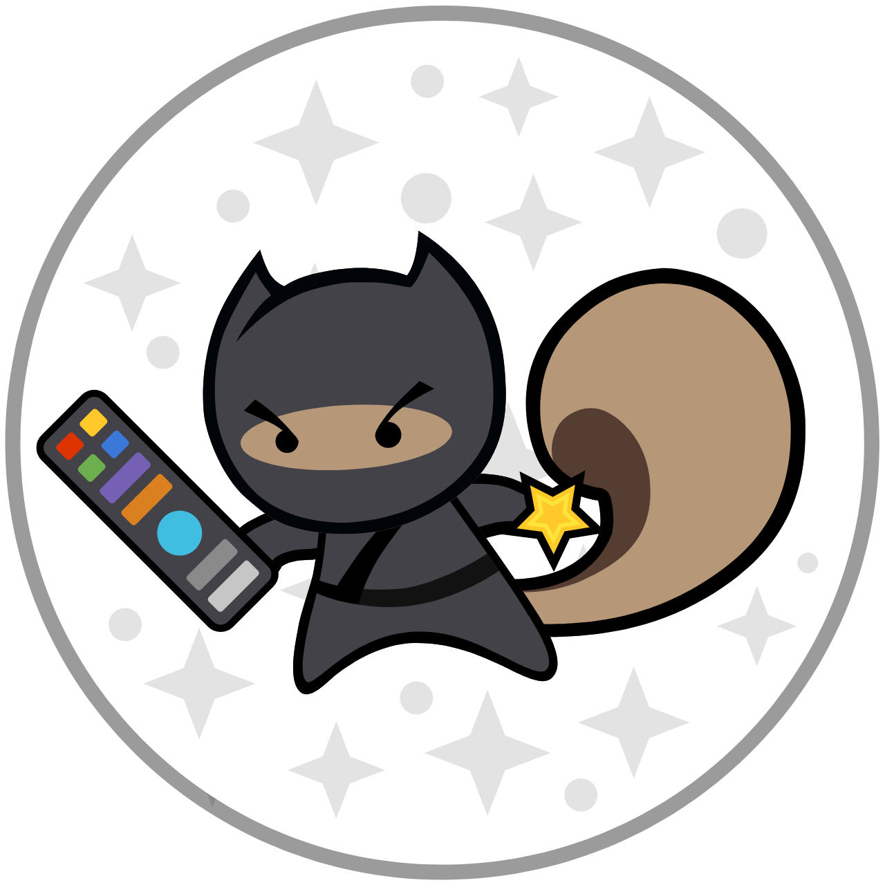

# ninja-squirrel-image-assets

Ninja Squirrels team; logos, and art assets - including interactive avatar designer.

## Avatar Designer

To create your own variation of the Ninja Squirrels logo; based on our asset template; visit:

>https://bbc.github.io/ninja-squirrel-image-assets/designer/

## Baked Assets

Using the assets; we have prebaked image assets to use in other projects. We recommend deeplinking to these URLs so that your projects are less likely to have out of date assets.

  

  

  

## SVG Source Asset

The point of truth; use if your target platform supports SVG - this file is smaller in file size; provides a screen agnostic high resolution, but may require more processing power to render.

  

## Approved SVG Editor

Please download and install Inkscape vector editor (available for free on Windows, Mac, Linux). Inkscape provides a high quality set of tools for creating and editing precise SVG files; without too much junk data.

>https://inkscape.org/

## Local Development

For local development; clone this repo then run:
- `npm install`
- `npm start`

This should open up a local development window running on:
- http://localhost:8900/designer/

This page will allow you to customise the avatar and save out your own version as a new SVG file. You should use local development mode in conjunction with Inkscape to update layers and add new art assets in a way that is compatible with the Avatar Designer.
